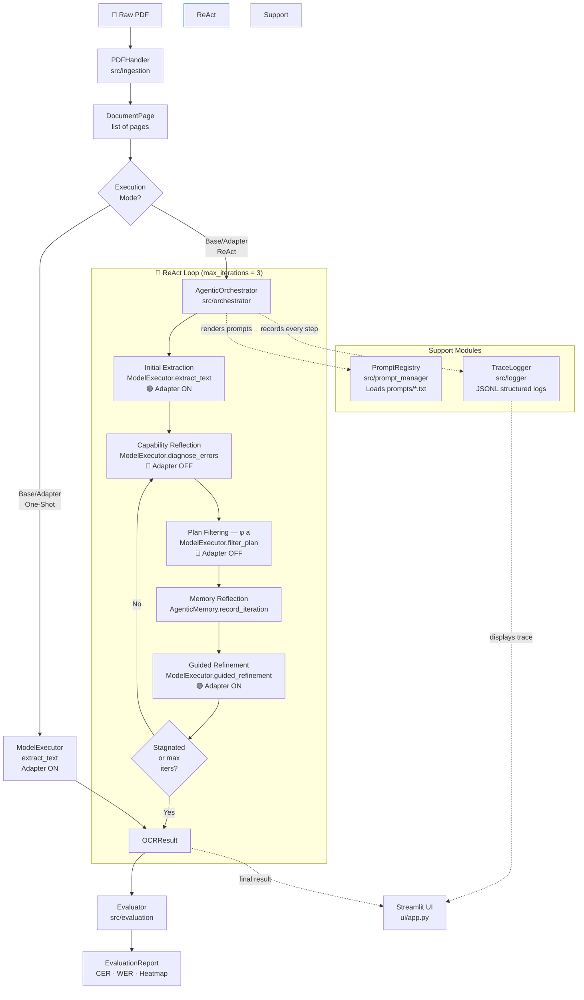

# 📜 Agentic OCR Framework

**HumanAI RenAIssance — GSoC Evaluation Submission**

> *A modular, research-grade OCR pipeline for extracting text from degraded
> 17th-century Spanish manuscripts via iterative self-correction with
> Capability Reflection and Memory Reflection.*

[](https://www.python.org/)
[](https://streamlit.io/)
[](https://arxiv.org/abs/2602.21053)
[](LICENSE)

---

## Abstract

This project implements the **OCR-Agent** framework
([arXiv:2602.21053](https://arxiv.org/abs/2602.21053)) as a production-grade,
modular Python pipeline. The system uses a Qwen2.5-VL Vision-Language Model
augmented with domain-specific LoRA adapters to transcribe highly degraded
historical manuscripts. Its core innovation is a structured ReAct loop with two
complementary self-correction mechanisms:

- **Capability Reflection** — The model diagnoses its own transcription errors,
  generates a correction plan, then filters out any actions beyond its executable
  scope (e.g., "apply image enhancement"), preventing *capability hallucination*.
- **Memory Reflection** — The model maintains a chronological ledger of past
  reflection attempts, ensuring each iteration explores new strategies rather than
  repeating previously failed corrections.

On the OCRBench v2 benchmark, this approach outperforms the open-source
state-of-the-art InternVL3-8B by **+2.0** on English and **+1.2** on Chinese
subsets without any additional training.

---

## System Architecture



---

## Installation

### Prerequisites

- Python 3.10 or higher
- CUDA 12.x with compatible GPU (recommended: ≥ 16 GB VRAM for 4-bit mode)
- `conda` (recommended) or `venv`

### Step 1 — Clone the Repository

```bash
git clone https://github.com/your-org/agentic-ocr-framework.git
cd agentic-ocr-framework
```

### Step 2 — Create Environment

**Using conda (recommended):**

```bash
conda create -n ocr-agent python=3.10 -y
conda activate ocr-agent
```

**Using venv:**

```bash
python -m venv .venv
source .venv/bin/activate   # Linux/macOS
.venv\Scripts\activate      # Windows
```

### Step 3 — Install Dependencies

```bash
pip install -r requirements.txt
```

> **GPU Note:** `bitsandbytes` requires CUDA. If you see CUDA errors, ensure your
> `torch` and CUDA versions are compatible:
> ```bash
> python -c "import torch; print(torch.cuda.is_available())"
> ```

### Step 4 — (Optional) Download LoRA Adapter Weights

Pre-trained LoRA adapters for 17th-century Spanish manuscripts:

```bash
# Download from Hugging Face Hub (placeholder — replace with real model ID)
python -c "
from huggingface_hub import snapshot_download
snapshot_download(repo_id='your-org/manuscript-lora-v1', local_dir='models/lora_manuscript_v1')
"
```

---

## Usage

### Run the Streamlit GUI

```bash
streamlit run ui/app.py
```

Then open [http://localhost:8501](http://localhost:8501) in your browser.

**Workflow in the UI:**
1. Select an **Execution Mode** in the sidebar (`Adapter_ReAct` recommended).
2. Enter the **LoRA Adapter Path** (if using an adapter).
3. Upload a **PDF manuscript** via the file uploader.
4. Optionally upload a **Ground Truth `.txt` file** for evaluation.
5. Click **🚀 Run Pipeline**.
6. View the transcription in the right column and expand the
   **🧠 Agentic Trace / Logs** panel to inspect the model's reasoning process.

---

### Run Evaluation via Command Line

```bash
# Evaluate a single PDF against ground truth
python -m src.evaluation.run_eval \
    --pdf       data/raw_pdfs/manuscript_1640.pdf \
    --gt        data/ground_truth/manuscript_1640_gt.txt \
    --mode      Adapter_ReAct \
    --adapter   models/lora_manuscript_v1 \
    --output    results/
```

> **Note:** `src/evaluation/run_eval.py` is a planned script. Implement it as an
> argparse entry-point that chains `PDFHandler → AgenticOrchestrator → Evaluator`.

---

### Run the Test Suite

```bash
# Run all tests
pytest tests/ -v

# Run with coverage report
pytest tests/ -v --cov=src --cov-report=html

# Run only implemented tests (skip tests marked as pending)
pytest tests/ -v -k "not skip"
```

Expected output (with stubs not yet implemented):

```
PASSED tests/test_pipeline.py::TestMemoryReflection::test_initial_state_is_empty
PASSED tests/test_pipeline.py::TestMemoryReflection::test_record_iteration_appends_to_all_lists
PASSED tests/test_pipeline.py::TestMemoryReflection::test_memory_prevents_identical_sequential_outputs
PASSED tests/test_pipeline.py::TestEvaluationMetrics::test_perfect_match_cer_is_zero   [jiwer required]
...
```

---

## Module Reference

| Module | Location | Responsibility |
|---|---|---|
| `PDFHandler` | `src/ingestion/pdf_handler.py` | PDF → page images via PyMuPDF |
| `PromptRegistry` | `src/prompt_manager/prompt_registry.py` | Load & render `prompts/*.txt` |
| `ModelExecutor` | `src/model_engine/model_executor.py` | Qwen-VL inference + LoRA adapter lifecycle |
| `AgenticOrchestrator` | `src/orchestrator/agentic_orchestrator.py` | ReAct loop with Capability + Memory Reflection |
| `Evaluator` | `src/evaluation/evaluator.py` | CER, WER, confusion matrix, error heatmap |
| `TraceLogger` | `src/logger/trace_logger.py` | JSONL structured step logging |

---

## Execution Modes

| Mode | Adapters | Reflection Loop | Use Case |
|---|---|---|---|
| `Base_OneShot` | ❌ | ❌ | Baseline benchmarking |
| `Base_ReAct` | ❌ | ✅ | Ablation: reflection without domain adaptation |
| `Adapter_OneShot` | ✅ | ❌ | Ablation: domain adaptation without reflection |
| `Adapter_ReAct` | ✅ | ✅ | **Full system — recommended for production** |

---

## Dynamic LoRA Switching

The most important architectural feature of this codebase is **dynamic adapter
switching** within a single agentic iteration:

| Step | Adapter | Rationale |
|---|---|---|
| `extract_text` | 🟢 ON | Domain weights → historical glyph recognition |
| `diagnose_errors` | 🔴 OFF | Base reasoning → unbiased correction planning |
| `filter_plan` | 🔴 OFF | Base reasoning → capability awareness |
| `guided_refinement` | 🟢 ON | Domain weights → historically-informed rewrite |

See `AGENT_INSTRUCTIONS.md` §1 for the full specification and code examples.

---

## Prompt Templates

All prompts are stored in `prompts/` as plain `.txt` files — **no prompt text
appears in Python source**. Templates use `{variable_name}` placeholders that are
injected at runtime by `PromptRegistry.render()`.

| File | Purpose |
|---|---|
| `initial_extraction.txt` | Zero-shot first-pass transcription |
| `capability_reflection.txt` | Error diagnosis + correction planning |
| `capability_filter.txt` | Remove infeasible actions from plan |
| `memory_reflection.txt` | Cross-reference plan against history |
| `guided_refinement.txt` | Execute the plan to produce refined text |

---

## Evaluation Metrics

| Metric | Implementation | Description |
|---|---|---|
| CER | `jiwer.cer()` | Character Error Rate |
| WER | `jiwer.wer()` | Word Error Rate |
| Confusion Matrix | `Levenshtein.editops()` | Character substitution frequency map |
| Error Heatmap | PIL + difflib | Visual overlay on manuscript image |

---

## Project Structure

```
agentic_ocr_framework/
├── src/
│   ├── models.py                   ← Pydantic data entities
│   ├── ingestion/pdf_handler.py    ← PDF ingest & rasterisation
│   ├── prompt_manager/             ← Template loading & versioning
│   ├── model_engine/               ← Qwen-VL + LoRA management
│   ├── orchestrator/               ← ReAct loop implementation
│   ├── evaluation/                 ← Metrics & visualisation
│   └── logger/                     ← Structured trace logging
├── tests/test_pipeline.py          ← Full pytest suite
├── ui/app.py                       ← Streamlit GUI
├── prompts/                        ← All prompt templates (.txt)
├── data/
│   ├── raw_pdfs/                   ← Input documents
│   ├── ground_truth/               ← Reference transcriptions
│   └── output_images/              ← Rasterised pages + heatmaps
├── logs/                           ← Auto-generated JSONL traces
├── requirements.txt
├── AGENT_INSTRUCTIONS.md           ← Rules for AI coding agents
└── README.md                       ← This file
```

---

## Contributing / Development

1. All inter-module data uses the Pydantic models in `src/models.py`.
2. All prompts live in `prompts/` — never hardcode strings in Python.
3. All new execution modes must follow the adapter-switching rule (see `AGENT_INSTRUCTIONS.md`).
4. Run `pytest tests/ -v` before submitting a PR; all non-`skip` tests must pass.
5. Bump the `# version:` comment in any modified prompt file.

---

## Citation

```bibtex
@article{wen2026ocragent,
  title   = {OCR-Agent: Agentic OCR with Capability and Memory Reflection},
  author  = {Wen, Shimin and Zhang, Zeyu and Bian, Xingdou and Zhu, Hongjie and
             He, Lulu and Shama, Layi and Ergu, Daji and Cai, Ying},
  journal = {arXiv preprint arXiv:2602.21053},
  year    = {2026}
}
```

---

## License

MIT License. See [LICENSE](LICENSE) for details.
