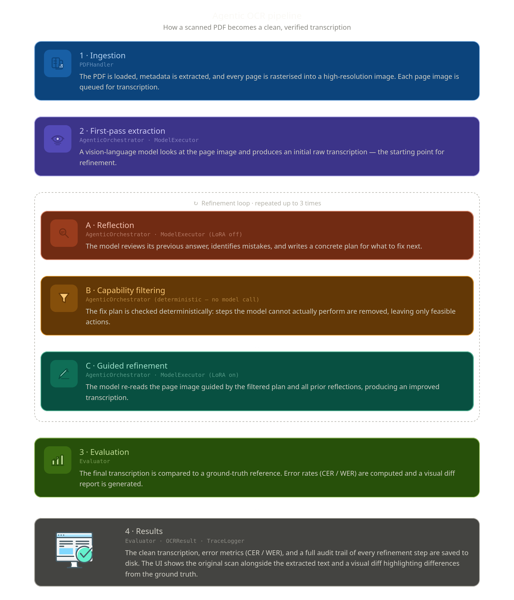
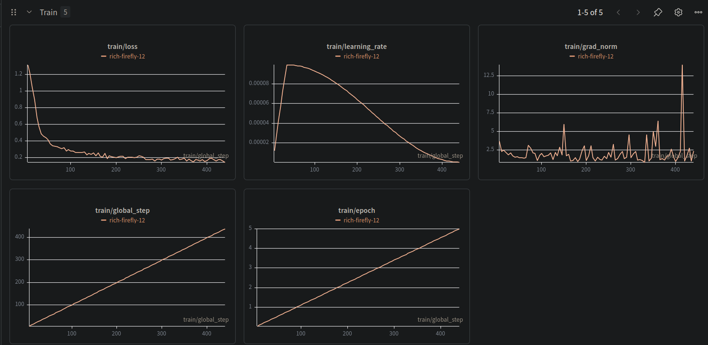
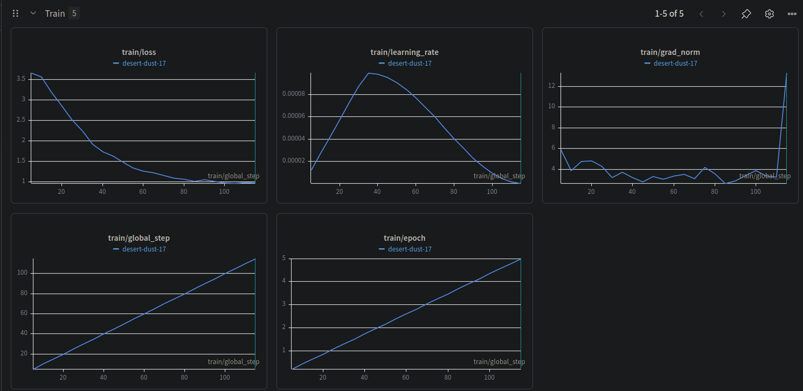

# 📜 Agentic OCR Framework

<p align="center">
  
</p>

<p align="center">
  <strong>HumanAI RenAIssance — GSoC 2026 Evaluation Submission</strong><br/>
  <em>Iterative self-correction pipeline for 17th-century Spanish manuscripts<br/>
  via Capability Reflection & Memory Reflection</em>
</p>

<p align="center">
  <a href="https://www.python.org/"></a>
  <a href="https://streamlit.io/"></a>
  <a href="https://arxiv.org/abs/2602.21053"></a>
  <a href="LICENSE"></a>
</p>

---

## Results

### Baseline: Traditional OCR engines on the same 5 documents

To contextualise the pipeline's performance, the same five test documents
were evaluated using Tesseract (Spanish) and EasyOCR (Spanish).
Full evaluation notebook: `notebooks/baseline_ocr_comparison.ipynb`

| Document | EasyOCR CER | EasyOCR WER | Tesseract CER | Tesseract WER |
|---|---|---|---|---|
| ahpg-gpah au61 2 – 1606 | 44.23% | 93.33% | 65.32% | 109.17% |
| pt3279 146 342 – 1857 | 62.24% | 97.40% | 63.04% | 95.83% |
| pleito entre el marqués de viana | 72.05% | 114.03% | 51.73% | 100.90% |
| es 28079 ahn inquisición1667 | 68.51% | 98.94% | 66.70% | 95.24% |
| ahpg-gpah 1 1716a 35 – 1744 | 56.98% | 98.94% | 60.21% | 119.58% |
| **Average** | **60.80%** | **100.53%** | **61.40%** | **104.14%** |

> WER exceeding 100% indicates the engine produces more word-level errors
> than there are words in the ground truth — a complete failure on this
> document type.

### Pipeline results: Base_ReAct mode (no fine-tuned adapter)

Evaluated on all 5 handwritten test documents. Average CER: **22.19%** —
a **38.6 percentage point improvement** over traditional engines,
with no domain-specific fine-tuning.

| Document | Period | CER | WER |
|---|---|---|---|
| ahpg-gpah au61 2 – 1606 | 1606 | **13.58%** | 43.61% |
| pt3279 146 342 – 1857 | 1857 | **15.82%** | 50.00% |
| pleito entre el marqués de viana | 17th c. | **22.25%** | 56.56% |
| es 28079 ahn inquisición1667 | 1640 | **23.59%** | 61.90% |
| ahpg-gpah 1 1716a 35 – 1744 | 1744 | **35.69%** | 82.54% |
| **Average** | | **22.19%** | **58.92%** |

> CER is computed after normalisation: Unicode ligature expansion,
> lowercase, accent stripping (preserving ñ), Unicode-aware punctuation
> removal, whitespace collapse. See `src/evaluation/evaluator.py`.
```

---

## Abstract

This project implements the **OCR-Agent** framework ([arXiv:2602.21053](https://arxiv.org/abs/2602.21053)) as a production-grade, modular Python pipeline for transcribing highly degraded historical manuscripts. The VLM operates at every stage of the pipeline — initial extraction, reflection, capability filtering, and guided refinement — satisfying the requirement that the model is used throughout the process, not as a late-stage post-processing step.

Its two core self-correction mechanisms are:

- **Capability Reflection** — The model diagnoses its own transcription errors, generates a correction plan, then filters out any actions beyond its executable scope (e.g. "apply image enhancement", "consult a human expert"), preventing *capability hallucination*.
- **Memory Reflection** — The model maintains a chronological ledger of all past reflection attempts across iterations, ensuring each refinement step explores new strategies rather than repeating previously failed corrections.

---

## System Architecture

The pipeline runs **7 sequential model calls per page** across 3 fixed iterations:

```
┌──────────────────────────────────────────────────────────────────────┐
│  [1] Initial Extraction                                              │
│      VLM(image, prompt) → A₀                                        │
│      Memory: M₁ = ∅                                                 │
└─────────────────────────┬────────────────────────────────────────────┘
                          │  repeat 3×  (i = 1, 2, 3)
                          ▼
┌──────────────────────────────────────────────────────────────────────┐
│  [2] Capability Reflection  (vision call)                            │
│      Rᵢ = Reflect(image, Q, Aᵢ₋₁, Mᵢ)                              │
│      → diagnoses errors, proposes correction plan P                  │
│                                                                      │
│  [3] Capability Filtering   (code — no model call)                   │
│      Pfeas = { a ∈ P | a is within model capability }               │
│      → strips infeasible actions (image editing, human review…)      │
│                                                                      │
│  [4] Guided Refinement      (vision call)                            │
│      Aᵢ = Refine(image, Q, Aᵢ₋₁, Pfeas, Mᵢ ∪ {Rᵢ})                │
│      → produces improved transcription                               │
│                                                                      │
│  Memory update: Mᵢ₊₁ = Mᵢ ∪ {Rᵢ}                                   │
└──────────────────────────────────────────────────────────────────────┘
                          │
                          ▼
                     Final answer: A₃
```



### Dynamic LoRA Adapter Switching (local backend)

When using a local fine-tuned model, the adapter toggles within each iteration:

| Step | Adapter | Rationale |
|---|---|---|
| `extract_text` | 🟢 ON | Domain weights → historical glyph recognition |
| `diagnose_errors` | 🔴 OFF | Base reasoning → unbiased correction planning |
| `filter_plan` | 🔴 OFF | Base reasoning → capability awareness |
| `guided_refinement` | 🟢 ON | Domain weights → historically-informed rewrite |

---

## Execution Modes

| Mode | Adapter | Reflection Loop | Use Case |
|---|---|---|---|
| `Base_OneShot` | ❌ | ❌ | Baseline benchmarking |
| `Base_ReAct` | ❌ | ✅ | Reflection without domain adaptation |
| `Adapter_OneShot` | ✅ | ❌ | Domain adaptation without reflection |
| `Adapter_ReAct` | ✅ | ✅ | Full system — recommended |

---

## Fine-Tuning Experiments

Two genuine fine-tuning runs were conducted on `Qwen3.5-0.8B` using LoRA adapters. These runs are documented here as first-class experimental findings, not as failed attempts to be hidden.

### Run 1 — Printed Historical Spanish Text

| | |
|---|---|
| Training data | ~2,200 image-transcription pairs |
| Epochs | 5 |
| Result | CER: 8% → 9% (marginal change) |
| Finding | The base VLM's zero-shot capability on printed text is already near saturation at this data volume. Printed text is regular and predictable enough that a general-purpose VLM handles it well without domain adaptation. |



| Resource | Link |
|---|---|
| HuggingFace Dataset | [Ak137/Historical-Spanish-VLM-OCR-Qwen](https://huggingface.co/datasets/Ak137/Historical-Spanish-VLM-OCR-Qwen) |
| HuggingFace LoRA Adapter | [Ak137/qwen3.5-0.8B-spanish-ocr-lora](https://huggingface.co/Ak137/qwen3.5-0.8B-spanish-ocr-lora) |
| Training notebook | `notebooks/finetunning_qwen3.5_spanish_ocr.ipynb` |

---

### Run 2 — Handwritten Historical Spanish Text

| | |
|---|---|
| Training data | ~500 image-transcription pairs |
| Epochs | 5 |
| Result | CER: 30% → 65% (catastrophic overfitting) |
| Finding | 500 samples across 5 epochs caused the model to memorize training transcriptions rather than learn generalizable glyph patterns. The training data distribution (modern handwriting datasets) did not match the test distribution (17th-century Spanish archive documents). This result directly motivates the agentic approach: for low-resource historical handwriting scenarios, structured iterative self-correction with a capable base VLM outperforms fine-tuning a small model on a mismatched small dataset. |



| Resource | Link |
|---|---|
| HuggingFace Dataset | [Ak137/Handwritten_Historical_Spanish](https://huggingface.co/datasets/Ak137/Handwritten_Historical_Spanish) |
| HuggingFace LoRA Adapter | [Ak137/qwen3.5-0.8B-handwritten-spanish-ocr-lora](https://huggingface.co/Ak137/qwen3.5-0.8B-handwritten-spanish-ocr-lora) |
| Training notebook | `notebooks/finetunning_qwen3.5_spanish_ocr.ipynb` |

---

## Backend Configuration

The pipeline supports two backends, switchable via `config.yaml` without touching any source code.

```yaml
# Switch between 'local' and 'openrouter'
backend: openrouter

openrouter:
  api_key: ${OPENROUTER_API_KEY}   # set in .env
  model: google/gemini-2.0-flash-001
  max_tokens: 4096
  temperature: 0.1

local:
  model_path: models/Qwen3.5-0.8B
  adapter_path: null               # path to LoRA adapter, or null
  load_in_4bit: true
```

---

## Installation

### Prerequisites

- Python 3.10+
- CUDA 12.x with compatible GPU (≥16 GB VRAM recommended for 4-bit local mode)
- `conda` or `venv`

### Setup

```bash
git clone [https://github.com/adham137/GSoC26-RenAIssance-OCR]
cd agentic-ocr-framework

# Create environment
conda create -n ocr-agent python=3.10 -y
conda activate ocr-agent

# Install dependencies
pip install -r requirements.txt

# Copy and fill in your API key
cp .env.example .env
# Edit .env: OPENROUTER_API_KEY=your_key_here
```

---

## Usage

### Streamlit UI

```bash
streamlit run ui/app.py
```

Open [http://localhost:8501](http://localhost:8501).

1. Select backend in `config.yaml` (`local` or `openrouter`)
2. Select **Execution Mode** in sidebar
3. Upload a **PDF manuscript**
4. Optionally upload a **Ground Truth `.txt`** for evaluation
5. Click **🚀 Run Pipeline**
6. View transcription and expand **🧠 Agentic Trace** to inspect the model's reasoning

### Command Line Evaluation

```bash
python -m src.evaluation.run_evaluation \
    --metadata  data/eval_ready/metadata.jsonl \
    --mode      Base_ReAct \
    --output    results/
```

### Tests

```bash
pytest tests/ -v
pytest tests/ -v --cov=src --cov-report=html
```

---

## Evaluation Methodology

All CER/WER scores are computed after the following normalisation pipeline, which mirrors the training normalisation to ensure fair comparison:

1. Unicode ligature expansion (`fi` → `fi`, `fl` → `fl`, etc.)
2. Lowercase
3. Accent stripping preserving `ñ` (NFD decomposition, drop Mn-category marks, NFC recomposition)
4. Unicode-aware punctuation removal (`[^\w\s]` with `re.UNICODE`)
5. Whitespace collapse

| Metric | Implementation | Notes |
|---|---|---|
| CER | `jiwer.cer()` | Character Error Rate |
| WER | `jiwer.wer()` | Word Error Rate |
| Confusion Matrix | `Levenshtein.editops()` | Character substitution map |
| Char-level diff | `difflib` + HTML | Visual error overlay in UI |

---

## Module Reference

| Module | Location | Responsibility |
|---|---|---|
| `PDFHandler` | `src/ingestion/pdf_handler.py` | PDF → page images via PyMuPDF |
| `BaseModelBackend` | `src/model_engine/base_backend.py` | Abstract interface for all backends |
| `LocalModelBackend` | `src/model_engine/local_backend.py` | Wraps ModelExecutor for local inference |
| `OpenRouterBackend` | `src/model_engine/openrouter_backend.py` | API backend with retry + image compression |
| `BackendFactory` | `src/model_engine/backend_factory.py` | Reads config.yaml, returns correct backend |
| `PromptRegistry` | `src/prompt_manager/prompt_registry.py` | Loads and renders `prompts/*.txt` templates |
| `AgenticOrchestrator` | `src/orchestrator/agentic_orchestrator.py` | ReAct loop: Capability + Memory Reflection |
| `Evaluator` | `src/evaluation/evaluator.py` | CER, WER, confusion matrix, diff HTML |
| `LexicalProcessor` | `src/postprocessing/lexical_processor.py` | Post-processing: watermark removal, non-Latin scrubbing, deduplication |
| `TraceLogger` | `src/logger/trace_logger.py` | JSONL structured step logging |

---

## Prompt Templates

All prompts are plain `.txt` files in `prompts/`. No prompt text appears in Python source. Variables use `{variable_name}` syntax, injected at runtime by `PromptRegistry.render()`.

| File | Stage | Notes |
|---|---|---|
| `initial_extraction.txt` | Step 0 | Zero-shot first-pass; explicit exclusions for watermarks/archive stamps; `[?]` convention for illegible text |
| `capability_reflection.txt` | Iter: Sub-step 1 | Error diagnosis + correction plan generation |
| `capability_filter.txt` | Iter: Sub-step 2 | Strips infeasible actions from plan |
| `memory_reflection.txt` | Iter: Sub-step 1 | Integrates full reflection history |
| `guided_refinement.txt` | Iter: Sub-step 3 | Executes filtered plan → produces Aᵢ |

---

## Project Structure

```
agentic_ocr_framework/
├── src/
│   ├── models.py                        ← Pydantic data entities
│   ├── ingestion/pdf_handler.py         ← PDF ingest & rasterisation
│   ├── prompt_manager/                  ← Template loading & versioning
│   ├── model_engine/
│   │   ├── base_backend.py              ← Abstract backend interface
│   │   ├── local_backend.py             ← Local VLM + LoRA wrapper
│   │   ├── openrouter_backend.py        ← OpenRouter API backend
│   │   ├── backend_factory.py           ← Config-driven backend selector
│   │   └── model_executor.py            ← Qwen-VL inference + LoRA lifecycle
│   ├── orchestrator/
│   │   └── agentic_orchestrator.py      ← ReAct loop implementation
│   ├── evaluation/
│   │   └── evaluator.py                 ← Metrics & visualisation
│   ├── postprocessing/
│   │   └── lexical_processor.py         ← Post-processing pipeline
│   └── logger/trace_logger.py           ← Structured trace logging
├── notebooks/
│   └── finetunning_qwen3.5_spanish_ocr.ipynb
├── tests/test_pipeline.py
├── ui/app.py                            ← Streamlit GUI
├── prompts/                             ← All prompt templates (.txt)
├── data/
│   ├── eval_ready/                      ← Preprocessed images + metadata.jsonl
│   └── output_images/                   ← Rasterised pages
├── logs/                                ← Auto-generated JSONL traces
├── models/                              ← LoRA adapter weights
├── config.yaml                          ← Backend configuration
├── .env.example                         ← API key template
├── requirements.txt
└── README.md
```

---

## Citation

```bibtex
@article{wen2026ocragent,
  title   = {OCR-Agent: Agentic OCR with Capability and Memory Reflection},
  author  = {Wen, Shimin and Zhang, Zeyu and Bian, Xingdou and Zhu, Hongjie and
             He, Lulu and Shama, Layi and Ergu, Daji and Cai, Ying},
  journal = {arXiv preprint arXiv:2602.21053},
  year    = {2026}
}
```

---

## License

MIT License. See [LICENSE](LICENSE) for details.
